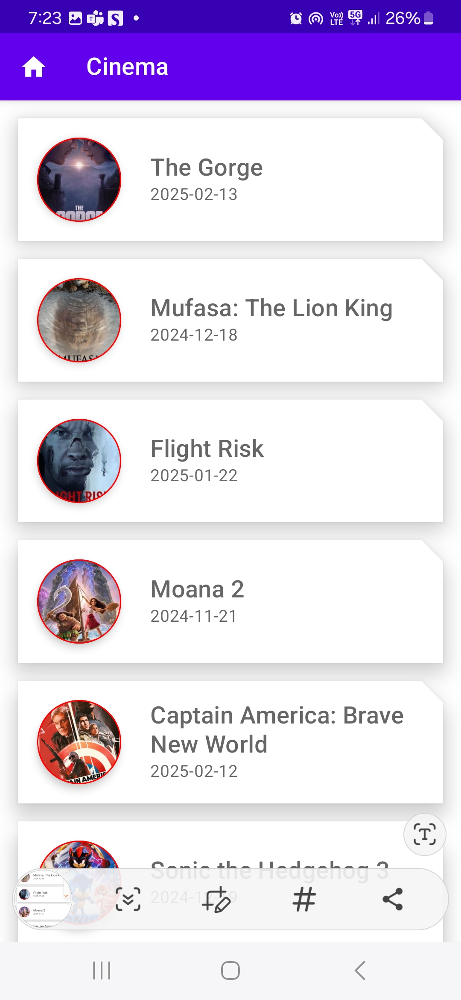
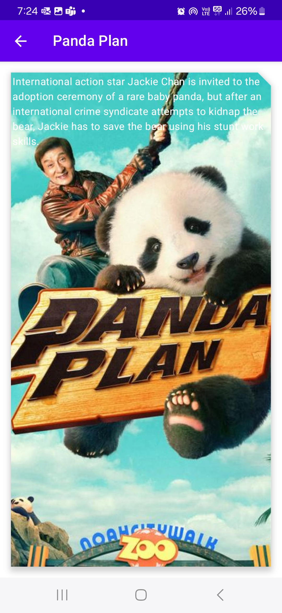

# Cinema Android application

Tech stack used - 
1. Multi modularization design to achieve loose coupling between software layers
2. Kotlin interoperable, object-oriented and functional programming language
3. Android Hilt DI simplifies the process of managing dependencies 
4. Retrofit simplifies the process by providing a clean and efficient way to make API calls 
5. Jetpack Compose is Android's recommended modern toolkit for building native UI
6. MVVM design pattern enhances code organization and maintainability 

Movie list screen

Movie detail screen

